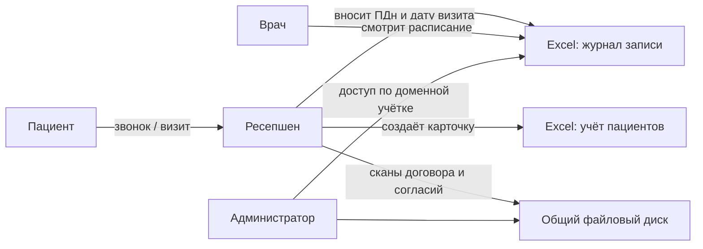
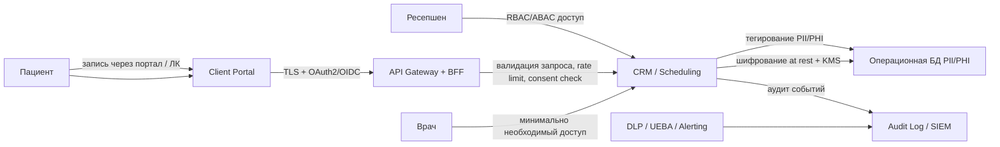
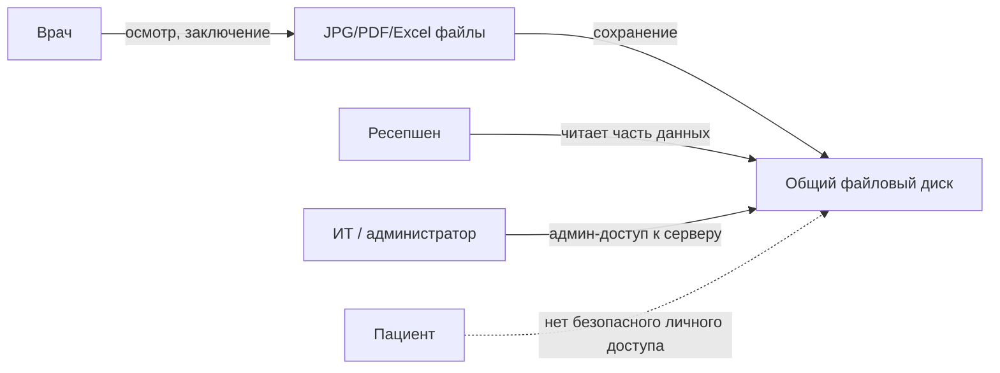
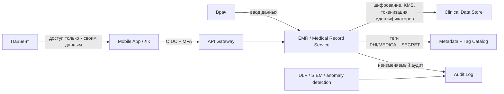
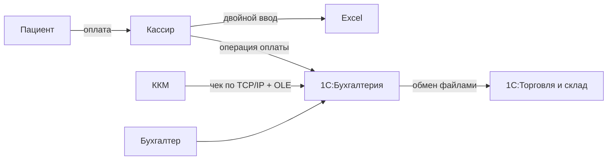
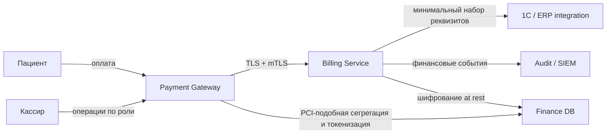
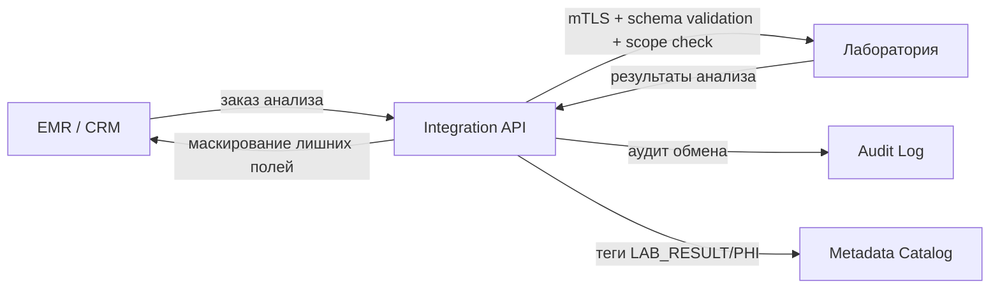

# Анализ безопасности системы "Медикаменте" (As-Is)

## 1. Контекст

Компания хранит и обрабатывает медицинские, персональные и финансовые данные преимущественно вручную:

- журналы записи, учёт пациентов и часть медицинских данных - в `Excel`, `JPG`, `PDF`;
- файлы лежат на общем диске на локальном сервере;
- платежи и бухгалтерия - в `1С:Бухгалтерия`;
- складской учёт - в `1С:Торговля и склад`;
- контроль доступа ограничен доменной аутентификацией;
- аудит действий в файлах и большинстве потоков отсутствует.

Это создаёт риски нарушения требований 152-ФЗ, утечки медицинской тайны, несанкционированного доступа и невозможности доказать корректность обработки данных.

## 2. Неучтённые конфиденциальные данные

Во внутренних системах фактически обрабатываются, но не классифицированы и не тегированы:

| Категория | Примеры |
|---|---|
| Идентификационные ПДн | ФИО, дата рождения, телефон, e-mail |
| Расширенные ПДн | адрес, место работы/учёбы, паспортные реквизиты в договорах |
| Специальные категории ПДн | хронические заболевания, назначения, анализы, диагнозы |
| Договорные данные | номер договора, история оказания услуг, согласия |
| Финансовые данные | платежи, возвраты, чеки, задолженности |
| Операционные данные | журнал приёма, история коммуникаций, напоминания |
| Данные сотрудников | роли, графики, кадровые и зарплатные сведения |
| Технические следы | вложения почты, сканы документов, экспорт из Excel, резервные копии |

## 3. DFD по ключевым процессам

### 3.1 Запись пациента на приём (As-Is)

**Риски**

- конфиденциальные данные находятся в Excel рядом с пользователем;
- на общем диске нет сегментации по чувствительности;
- нет сквозного аудита, кто смотрел или менял карточку пациента;
- договоры и согласия хранятся в виде файлов без явного жизненного цикла.

### 3.2 Запись пациента на приём (To-Be security overlay)

**Контроли**

- RBAC/ABAC по ролям и филиалу;
- шифрование БД и резервных копий;
- централизованный аудит доступа;
- тегирование `PII`, `PHI`, `CONSENT`, `FINANCE`;
- минимизация данных в UI и API.

### 3.3 Оказание услуги и ведение медицинской карты (As-Is)

**Риски**

- медицинская тайна хранится в неструктурированных файлах;
- отсутствует разделение рабочих и чувствительных наборов данных;
- администратор сервера потенциально видит медицинские документы;
- нет версионирования и контроля сроков хранения.

### 3.4 Оказание услуги и ведение медицинской карты (To-Be security overlay)

**Контроли**

- выделенный сервис медицинских записей;
- атрибутный доступ по роли, специальности, связи с визитом и филиалу;
- отдельный контур хранения медицинских данных;
- неизменяемый аудит чтения и изменения карты;
- политика удаления и архивирования.

### 3.5 Платёж и бухгалтерский учёт (As-Is)

**Риски**

- двойной ввод повышает вероятность ошибок и расхождений;
- Excel-копии платёжных данных расширяют поверхность утечки;
- legacy-интеграция ККМ по OLE слабо контролируется;
- обмен между `1С` системами не размечен по чувствительности.

### 3.6 Платёж и бухгалтерский учёт (To-Be security overlay)

**Контроли**

- исключение локального Excel-дублирования;
- токенизация платёжных идентификаторов;
- mTLS между шлюзом и внутренними сервисами;
- журналирование финансовых действий и сверок.

### 3.7 Интеграция с лабораторией (целевой процесс)

**Контроли**

- контракты API не раскрывают лишние поля;
- строгие `scopes`, anti-BOLA/BFLA проверки;
- схемы запросов и ответов версионируются;
- алерты при аномальном объёме запросов.

## 4. Аудит текущих мер безопасности

| Область | Текущее состояние | Оценка |
|---|---|---|
| Идентификация | Доменная аутентификация Windows | Частично покрывает базовый доступ |
| Авторизация | Грубая, без разделения по типам данных | Недостаточно |
| Хранение данных | Excel, PDF, JPG на общем диске | Критический риск |
| Шифрование | Не подтверждено для файлов, БД, backup | Недостаточно |
| Передача данных | Локальные обмены, OLE/TCP/IP, почта | Недостаточно |
| Аудит | Почти отсутствует | Критический риск |
| Data lineage | Нет | Критический риск |
| Минимизация | Не реализована | Критический риск |
| Сроки хранения | Не управляются централизованно | Высокий риск |
| DLP / мониторинг | Нет | Высокий риск |
| Управление секретами и ключами | Не выделено | Высокий риск |
| Резервное копирование и восстановление | Не описано, контроль доступа не выделен | Высокий риск |

## 5. Сопоставление процессов с практиками безопасности

| Процесс | Обязательные практики |
|---|---|
| Запись на приём | Privacy by Design, RBAC/ABAC, consent management, audit log, TLS |
| Ведение медкарты | Segregation of duties, PHI tagging, encryption at rest, immutable audit |
| Платежи | Tokenization, encryption in transit, reconciliation audit, least privilege |
| Хранение файлов | Data minimization, retention policy, encryption, DLP, backup controls |
| Интеграции с партнёрами | API gateway, schema validation, OAuth2/OIDC, mTLS, contract review |
| Аналитика / BI | Обезличивание, masked datasets, lineage, separate analytical zone |

## 6. Что улучшить в первую очередь

1. Убрать хранение медицинских и клиентских данных из Excel и общего файлового диска в централизованные сервисы.
2. Ввести классификацию, тегирование и каталог метаданных для `PII`, `PHI`, `FINANCE`, `CONSENT`.
3. Разделить контуры данных: операционный, клинический, финансовый, аналитический.
4. Реализовать RBAC/ABAC и принцип наименьших привилегий.
5. Включить сквозной аудит, DLP, SIEM и оповещения об аномалиях.
6. Встроить шифрование at rest / in transit и централизованное управление ключами.
7. Формализовать сроки хранения, удаление и обработку отзывов согласия.
