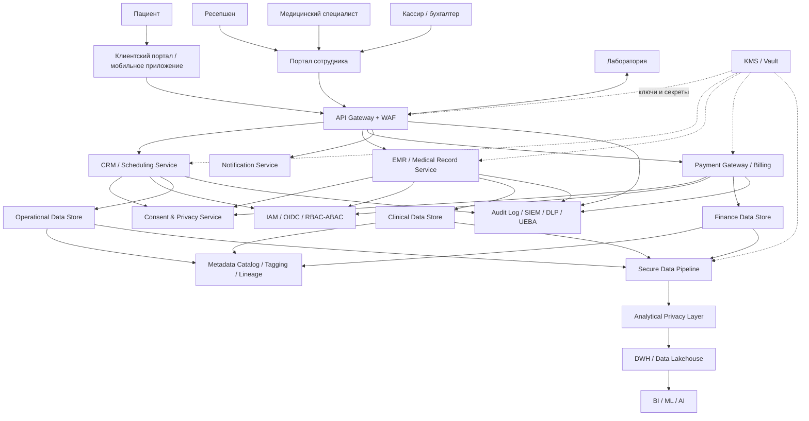

# C4 Context - целевое состояние MVP

## Ключевая идея

Целевая архитектура разделяет клиентский, операционный, клинический, финансовый и аналитический контуры. Защита конфиденциальных данных выносится в сквозные платформенные блоки, а не решается локально в каждом сервисе.

## Новые блоки, обеспечивающие Privacy by Design

1. `API Gateway + WAF` - единая точка входа, ограничение контрактов, rate limiting, авторизация.
2. `Identity & Access Management` - OIDC, MFA, RBAC/ABAC.
3. `Consent & Privacy Service` - хранение согласий, обработка запросов на удаление, политики минимизации.
4. `Metadata / Tag Catalog` - классификация, lineage, теги конфиденциальности.
5. `Audit, SIEM, DLP, UEBA` - аудит доступа, корреляция событий, алертинг.
6. `KMS / Vault` - управление ключами, секретами, сертификатами.
7. `Analytical Privacy Layer` - зона обезличивания и подготовки данных для BI/ML/AI.

## Диаграмма контекста

## Почему это соответствует заданию

- принципы `Privacy by Design` встроены в архитектуру, а не добавляются как постфактум;
- аналитический слой отделён от операционного и получает данные через контур обезличивания;
- новые интеграции проходят через единые контракты, теги и политики доступа;
- медицинские и финансовые данные разведены по доменам и моделям доступа.
