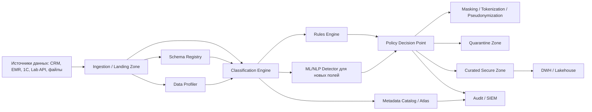

# C2 - Движок классификации данных перед загрузкой в хранилище

## Цель

Перед пакетной загрузкой в аналитическое хранилище определить:

- содержит ли набор конфиденциальные данные;
- к какому классу конфиденциальности относятся поля;
- можно ли загрузить набор как есть или требуется маскирование/обезличивание/карантин.

## Компоненты решения

## Назначение компонентов

| Компонент | Назначение |
|---|---|
| Landing Zone | принимает сырые пакеты данных и хранит их ограниченное время |
| Schema Registry | отслеживает версии структур и изменения схем |
| Data Profiler | считает null-rate, cardinality, regex match, распределения |
| Classification Engine | определяет класс поля по правилам и сигналам профилирования |
| Rules Engine | содержит политики по тегам и требованиям privacy |
| ML/NLP Detector | помогает распознавать новые или нестандартные поля |
| Policy Decision Point | решает: загрузить, замаскировать, обезличить или отправить в quarantine |
| Masking/Pseudonymization | преобразует данные для безопасной аналитики |
| Metadata Catalog | пишет теги, lineage, версию классификации |
| Audit/SIEM | фиксирует решения и аномалии |

## Предлагаемые слои в хранилище

1. `Raw Restricted Zone`
   Сырые данные с жёстким доступом, коротким сроком хранения и обязательным тегированием.

2. `Privacy Processing Zone`
   Слой, где выполняются классификация, mask/tokenize/pseudonymize и quality gates.

3. `Curated Secure Zone`
   Подготовленные наборы с контролируемым доступом для BI.

4. `Analytics Sandbox`
   Изолированная среда для ML/AI с обезличенными наборами и аудитом запросов.

## Метрики качества классификации

| Метрика | Зачем нужна |
|---|---|
| Precision | снижает ложные срабатывания и лишнюю блокировку данных |
| Recall | показывает, сколько чувствительных полей мы действительно находим |
| F1-score | баланс точности и полноты |
| False Negative Rate | критична, чтобы не пропускать PHI/PII |
| Time to classify | влияет на throughput пакетной загрузки |
| Drift rate | помогает замечать структурные изменения входных данных |
| Quarantine rate | показывает долю наборов, которые требуют ручного разбора |

## Как это помогает оптимизации системы

- рост `false negatives` сигнализирует о необходимости дообучить правила и модели;
- рост `time to classify` показывает bottleneck в пайплайне;
- рост `drift rate` заранее показывает, что upstream-источник изменил схему;
- `quarantine rate` помогает измерять качество контрактов данных и зрелость интеграций.

## Масштабируемость

- stateless-компоненты движка масштабируются горизонтально;
- классификация выносится в асинхронный pipeline;
- schema registry и metadata catalog позволяют безопасно переживать частые изменения структуры;
- правила и ML-модели версионируются отдельно от сервисов;
- большие наборы обрабатываются батчами с очередями и retry-политиками.
